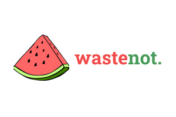

# WasteNot App
## Inspiration
According to the National Resources Defense Council, 40% of the food produced in America goes uneaten. This translates to about **$218 billion worth** of food that the nation wastes every year. One of the most significant reasons behind this is the misinterpretation of expiry or "best before" labels. Not only do these differ from country to country, but also from product to product. Thus, most consumers mistakenly believe date labels are safety indicators, which is why 90% report throwing away food once the expiration date arrives. Additionally, many consumers simply forget their fresh produce in their fridge or pantry.

This food waste is also taking a **big toll on our environment**. First, the resources spent creating food that gets thrown away include approximately: tens of millions of acres of cropland, 300 million barrels of oil, and 25% of freshwater usage in America alone. Second, this discarded food often winds up in landfills, where it contributes to harmful greenhouse gas emissions. Food waste makes up more than 20% of all content in American municipal landfills today.

**We need a universal, reliable, and accurate app that tracks these dates.**

## What it does

This is where WasteNot comes in. This mobile app reduces food waste by reminding the user about the items in their fridge before their projected expiry date

## How we built it

## Challenges we ran into

## Accomplishments that we're proud of

## What we learned

## What's next for WasteNot

